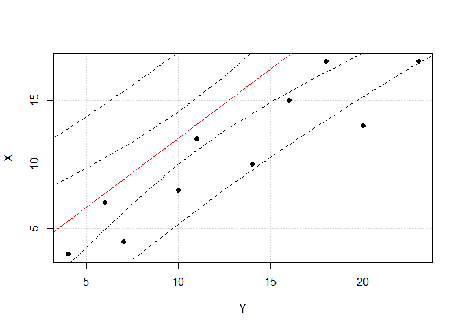
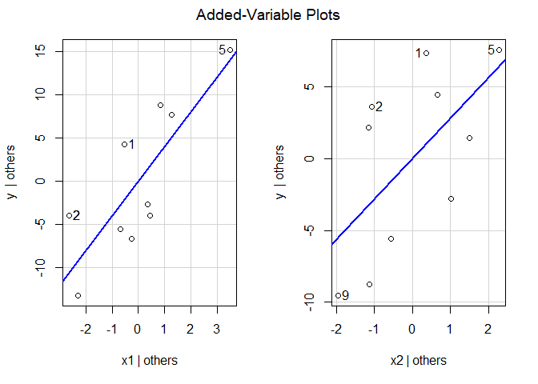

Regresión lineal y múltiple
================
Baruch Mejía Martínez
20/12/2021

La regresión lineal ajusta una ecuación lineal a datos observados. La
siguiente es una ecuación lineal
*Y* = *β*<sub>0</sub> + *β*<sub>1</sub>*X*

Primero, cargamos las librerias que se utilizarán.

``` r
library(readr)
library(ggplot2)
library(ggpubr)
library(car)
```

    ## Loading required package: carData

## Regresión lineal simple.

Cargamos los datos que buscamos ajustar.

``` r
X = c(18, 13 ,18 ,15 ,10 ,12 ,8 ,4, 7, 3)
Y = c(23, 20, 18, 16, 14, 11 ,10 ,7 ,6 ,4 )
datos = data.frame(Y, X)
n=dim(datos)[1]
datos
```

    ##     Y  X
    ## 1  23 18
    ## 2  20 13
    ## 3  18 18
    ## 4  16 15
    ## 5  14 10
    ## 6  11 12
    ## 7  10  8
    ## 8   7  4
    ## 9   6  7
    ## 10  4  3

Hacemos la regresión lineal con X = Methadone\_Dose, Y = QTc

``` r
model = lm(Y ~ X, datos)
r=summary(model)$r.squared
summary(model)
```

    ## 
    ## Call:
    ## lm(formula = Y ~ X, data = datos)
    ## 
    ## Residuals:
    ##     Min      1Q  Median      3Q     Max 
    ## -3.1988 -2.3808 -0.1638  1.8393  4.7189 
    ## 
    ## Coefficients:
    ##             Estimate Std. Error t value Pr(>|t|)    
    ## (Intercept)   1.2112     2.0557   0.589 0.571993    
    ## X             1.0823     0.1723   6.283 0.000237 ***
    ## ---
    ## Signif. codes:  0 '***' 0.001 '**' 0.01 '*' 0.05 '.' 0.1 ' ' 1
    ## 
    ## Residual standard error: 2.765 on 8 degrees of freedom
    ## Multiple R-squared:  0.8315, Adjusted R-squared:  0.8104 
    ## F-statistic: 39.47 on 1 and 8 DF,  p-value: 0.0002372

Obtenemos la ecuación de regresión
*Y* = 1.0823*X* + 1.2112
\#\#\# R-Cuadrado: El R-cuadrado es una medida estadística de qué tan
cerca están los datos de la línea de regresión ajustada. El R-cuadrado
siempre está entre 0 y 100%:

-   0% indica que el modelo no explica ninguna porción de la
    variabilidad de los datos de respuesta en torno a su media.
-   100% indica que el modelo explica toda la variabilidad de los datos
    de respuesta en torno a su media.

Calculamos el *coeficiente de determinación* *r*<sup>2</sup>

``` r
print(r)
```

    ## [1] 0.8314817

``` r
sqrt_r=sqrt(r)
sqrt_r
```

    ## [1] 0.9118562

y calculamos el coeficiente de correlación de Pearson r

``` r
cor(Y,X)
```

    ## [1] 0.9118562

Calculamos un intervalo de confianza y de predicción del modelo para una
*X* = 12

``` r
predict(model,data.frame(X=12), interval = "confidence")
```

    ##        fit      lwr      upr
    ## 1 14.19876 12.12698 16.27054

``` r
predict(model,data.frame(X=12), interval = "predict")
```

    ##        fit      lwr      upr
    ## 1 14.19876 7.494833 20.90268

Finalmente graficamos.

``` r
nuevas.x=data.frame(X=seq(0,25,by=25/(n)))
ic=predict(model, nuevas.x,interval = "confidence")
ip=predict(model, nuevas.x,interval = "prediction")
plot(Y,X,pch = 19, frame = TRUE,grid()) +abline(lm(Y ~ X,datos),col="red")+lines(nuevas.x$X,ic[,2],lty=2)+lines(nuevas.x$X,ic[,3],lty=2,col="black")+lines(nuevas.x$X,ip[,2],lty=2)+lines(nuevas.x$X,ip[,3],lty=2)
```

<!-- -->

    ## integer(0)

### Prueba de hipótesis de la regresión lineal simple.

Definiendo *H*<sub>0</sub> : *β*<sub>1</sub> = 0;
*H*<sub>*A*</sub> : *β*<sub>1</sub> ≠ 0 Esto nos dice que si
*H*<sub>0</sub> : *β*<sub>1</sub> = 0 el ajuste lineal no necesariamente
representa bien los datos. Si se cumple que
*H*<sub>*A*</sub> : *β*<sub>1</sub> ≠ 0 la regresión lineal hace un buen
ajuste de los datos.

Se puede usar ANOVA y el test t

**Para ANOVA:** si VR ≥ *F* rechazamos *H*<sub>0</sub>

**Para T-test:** si t-test ≥ *t* rechazamos *H*<sub>0</sub>

``` r
anova(model)
```

    ## Analysis of Variance Table
    ## 
    ## Response: Y
    ##           Df  Sum Sq Mean Sq F value    Pr(>F)    
    ## X          1 301.745 301.745  39.473 0.0002372 ***
    ## Residuals  8  61.155   7.644                      
    ## ---
    ## Signif. codes:  0 '***' 0.001 '**' 0.01 '*' 0.05 '.' 0.1 ' ' 1

Calculamos F-value, usando DF1=1 y DF2=8, significancia al 0.05

``` r
qf(0.95,1,8)
```

    ## [1] 5.317655

F-value≥qf rechazamos *H*<sub>0</sub>. también p &lt; 0.05 rechazamos
*H*<sub>0</sub>.

``` r
t_test=(model)
summary(t_test)
```

    ## 
    ## Call:
    ## lm(formula = Y ~ X, data = datos)
    ## 
    ## Residuals:
    ##     Min      1Q  Median      3Q     Max 
    ## -3.1988 -2.3808 -0.1638  1.8393  4.7189 
    ## 
    ## Coefficients:
    ##             Estimate Std. Error t value Pr(>|t|)    
    ## (Intercept)   1.2112     2.0557   0.589 0.571993    
    ## X             1.0823     0.1723   6.283 0.000237 ***
    ## ---
    ## Signif. codes:  0 '***' 0.001 '**' 0.01 '*' 0.05 '.' 0.1 ' ' 1
    ## 
    ## Residual standard error: 2.765 on 8 degrees of freedom
    ## Multiple R-squared:  0.8315, Adjusted R-squared:  0.8104 
    ## F-statistic: 39.47 on 1 and 8 DF,  p-value: 0.0002372

Calculamos t

``` r
qnorm(1-0.05/2)
```

    ## [1] 1.959964

Obtenemos T-test = 6.283 &gt; *t* = 1.96, rechazamos *H*<sub>0</sub>.

p-value &lt; 0.05, rechazamos *H*<sub>0</sub>

## Regresión lineal múltiple

Cargamos los datos a utilizar.

``` r
y = c(61.6,53.2,65.5,64.9,72.7,52.2,50.2,44,53.8,53.5)
x1 = c(6,4.4,9.1,8.1,9.7,4.8,7.6,4.4,9.1,6.7)
x2 = c(6.3,5.5,3.6,5.8,6.8,7.9,4.2,6,2.8,6.7)
datos=data.frame(y,x1,x2)
```

Hacemos el ajuste lineal múltiple

``` r
model = lm(y ~ x1 + x2, datos)
summary(model)
```

    ## 
    ## Call:
    ## lm(formula = y ~ x1 + x2, data = datos)
    ## 
    ## Residuals:
    ##     Min      1Q  Median      3Q     Max 
    ## -5.7005 -4.0547 -0.7874  4.6833  6.6122 
    ## 
    ## Coefficients:
    ##             Estimate Std. Error t value Pr(>|t|)   
    ## (Intercept)   13.449     13.232   1.016  0.34325   
    ## x1             4.017      1.071   3.749  0.00718 **
    ## x2             2.812      1.379   2.040  0.08076 . 
    ## ---
    ## Signif. codes:  0 '***' 0.001 '**' 0.01 '*' 0.05 '.' 0.1 ' ' 1
    ## 
    ## Residual standard error: 5.666 on 7 degrees of freedom
    ## Multiple R-squared:  0.6682, Adjusted R-squared:  0.5734 
    ## F-statistic: 7.049 on 2 and 7 DF,  p-value: 0.02104

Obtenemos la ecuación de regresión
*Y* = 4.017*X*<sub>1</sub> + 2.812*X*<sub>2</sub> + 13.449
Calculamos el **coeficiente de determinación múltiple**. Obtenemos
“Multiple R-square= 0.6682”.

Agregar sobre el coeficiente de correlación de varios órdenes

### Prueba de hipótesis Regresión múltiple

Usamos ANOVA y T-test con la prueba de hipótesis
$$H\_0: \\beta\_1=0 \\phantom{a}\\beta\_2=0 \\phantom{aaa} H\_A: \\beta\_1\\neq 0 \\phantom{a}\\beta\_2\\neq0 $$

**Regla de desición (ANOVA):** si VR<sub>1</sub>,VR<sub>2</sub> &gt; *C*
entonces rechazamos *H*<sub>0</sub>

**Regla de desición (T-test):** si T-value<sub>1</sub>,T-value$\_2&gt;
$qt entonces rechazamos *H*<sub>0</sub>

``` r
anova(model)
```

    ## Analysis of Variance Table
    ## 
    ## Response: y
    ##           Df Sum Sq Mean Sq F value  Pr(>F)  
    ## x1         1 319.03  319.03  9.9386 0.01609 *
    ## x2         1 133.53  133.53  4.1599 0.08076 .
    ## Residuals  7 224.70   32.10                  
    ## ---
    ## Signif. codes:  0 '***' 0.001 '**' 0.01 '*' 0.05 '.' 0.1 ' ' 1

``` r
k = 2
N = length(x1) + length(y) + length(x2)
C = qf(0.05,k,N-k-1,lower.tail = FALSE)
N
```

    ## [1] 30

``` r
lm(y ~ x1 + x2, datos)$df
```

    ## [1] 7

Dado que VR<sub>1</sub>,VR<sub>2</sub> &gt; *C* entonces rechazamos
*H*<sub>0</sub>.

*P*<sub>1</sub>, *P*<sub>2</sub> &lt; 0.05, entonces rechazamos
*H*<sub>0</sub>.

Calculamos T-value<sub>1, 2</sub>

``` r
summary(model)
```

    ## 
    ## Call:
    ## lm(formula = y ~ x1 + x2, data = datos)
    ## 
    ## Residuals:
    ##     Min      1Q  Median      3Q     Max 
    ## -5.7005 -4.0547 -0.7874  4.6833  6.6122 
    ## 
    ## Coefficients:
    ##             Estimate Std. Error t value Pr(>|t|)   
    ## (Intercept)   13.449     13.232   1.016  0.34325   
    ## x1             4.017      1.071   3.749  0.00718 **
    ## x2             2.812      1.379   2.040  0.08076 . 
    ## ---
    ## Signif. codes:  0 '***' 0.001 '**' 0.01 '*' 0.05 '.' 0.1 ' ' 1
    ## 
    ## Residual standard error: 5.666 on 7 degrees of freedom
    ## Multiple R-squared:  0.6682, Adjusted R-squared:  0.5734 
    ## F-statistic: 7.049 on 2 and 7 DF,  p-value: 0.02104

Calculamos T para 7 grados de libertad

``` r
qt(1-0.05/2,7)
```

    ## [1] 2.364624

Ya que T-value<sub>1</sub>,T-value$\_2&gt; $qt entonces rechazamos
*H*<sub>0</sub>.

Ya que p-value &lt; 0.05, entonces rechazamos *H*<sub>0</sub>.

``` r
avPlots(model)
```

<!-- -->
